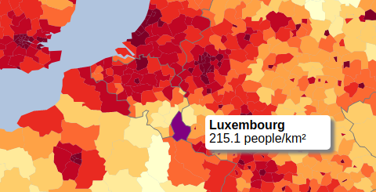

# Nuts2json

[Nuts2json](https://github.com/eurostat/Nuts2json) provides various reusable versions of [Eurostat NUTS dataset](http://ec.europa.eu/eurostat/web/nuts/overview) as web formats such as [TopoJSON](https://github.com/mbostock/topojson/wiki) and [GeoJSON](http://geojson.org/). It is provided to support the development of statistical web maps of [Eurostat data](http://ec.europa.eu/eurostat/) based on NUTS regions. In a way, it provides a blank map of geometries ready for use with your own data and colors.

Examples: For an example of such blank map, see [this map](http://eurostat.github.io/Nuts2json/overview.html?proj=3035&lvl=3&s=1000&y=2016). For an example of statistical map, see [this map](http://eurostat.github.io/EurostatVisu/population_map.html?proj=3035&lvl=3&s=1000&time=2016) showing population in Europe.

[](http://eurostat.github.io/EurostatVisu/population_map.html)

## API

The files can be retrieved on-the-fly from the base URL `https://raw.githubusercontent.com/eurostat/Nuts2json/gh-pages/` according to one of these file patterns:

- For [TopoJSON](https://github.com/mbostock/topojson/wiki) format: `/<YEAR>/<PROJECTION>/<SIZE>/<NUTS_LEVEL>.json`
- For [GeoJSON](http://geojson.org/) format: `/<YEAR>/<PROJECTION>/<SIZE>/<TYPE>_<NUTS_LEVEL>.json`

For example, [`https://raw.githubusercontent.com/eurostat/Nuts2json/gh-pages/2016/3035/600px/2.json`](https://raw.githubusercontent.com/eurostat/Nuts2json/gh-pages/2016/3857/600px/2.json)</a> returns a TopoJSON file of 2016 NUTS regions level 2 in European LAEA projection ([EPSG 3035](http://spatialreference.org/ref/epsg/etrs89-etrs-laea/)), for a map size 600*600px.

The parameters are:

| Parameter | Supported values | Description |
| ------------- | ------------- |-------------|
| `YEAR` | `2013` `2016` | The NUTS year version. |
| `PROJECTION` | `3035`, `3857`, `4258` | The coordinate reference system among: - European LAEA projection ([EPSG 3035](http://spatialreference.org/ref/epsg/etrs89-etrs-laea/)) - Web Mercator ([EPSG 3857](http://spatialreference.org/ref/sr-org/7483/)) - ETRS89 ([EPSG 4258](http://spatialreference.org/ref/epsg/4258/)). For statistical maps, it is strongly adviced to use an equal-area projection such as `3035`. |
| `SIZE` | `400`, `600`, `800`, `1000`, `1200` | The intended map size, in pixel. Yes: the maps are squared ! The smaller the value, the stronger the simplification. |
| `NUTS_LEVEL` | `0`, `1`, `2`, `3` | The NUTS level to be shown on the map, from national level (NUTS_LEVEL=0) to provincial level (NUTS_LEVEL=3). |
| `TYPE` | `nutsrg`, `nutsbn`, `cntrg`, `cntbn` | For [GeoJSON](http://geojson.org/) format, the feature type has to be specified. The available feature types are described below. |

For additional projections, formats, sizes, etc., feel free to [ask](https://github.com/eurostat/Nuts2json/issues/new) !

### Feature types

Four feature types are provided:

NUTS regions (feature type `nutsrg`) with the following properties:
  - `id`: The NUTS identifier to be used to join Eurostat statistical figures and then assign colors to the regions.
  - `na`: The geographical name of the region.

NUTS boundaries (feature type `nutsbn`) with the following properties:
  - `lvl`: The NUTS level of the boundary, from 0 (national level) to 3 (provincial level).
  - `eu`: T if the boundary separate two EU member states, F otherwise.
  - `efta`: T if the boundary touches at least one EFTA country, F otherwise.
  - `cc`: T if the boundary touches at least one Candidate Country, F otherwise.
  - `oth`: T if the boundary touches a country wich is not EU, EFTA,CC. F otherwise.
NB: Coastal boundaries are not included.

Non-european countries (feature type `cntrg`) with the following properties:
  - `id`: The country identifier (2 letters code).
  - `na`: The country name.

Non-european boundaries (feature type `cntbn`). Coastal boundaries are not included.


## Usage example

A map showing the TopoJSON geometries with [d3js](https://d3js.org/):

(See it online [here](https://eurostat.github.io/Nuts2json/usage.html)).

```html
<!DOCTYPE html>

<svg width="800px" height="800px"></svg>

<script src="https://d3js.org/d3.v4.min.js"></script>
<script src="https://d3js.org/topojson.v1.min.js"></script>

<style>
	.rg { fill: #fdbf6f; }
	.rg:hover { fill: #ff7f00; }
	.bn { fill: none; stroke-linecap:round; stroke-linejoin:round }
	.bn_0 { stroke: #333; stroke-width: 1.3px; }
	.bn_1 { stroke: #333; stroke-width: 1px; }
	.bn_2 { stroke: #333; stroke-width: 1px; }
	.bn_3 { stroke: #333; stroke-width: 0.7px; }
	.bn_oth { stroke: #aaa; stroke-width: 1px; }
	.cntrg { fill: lightgray; }
	.cntrg:hover { fill: darkgray; }
	.cntbn { fill: none; stroke: #aaa; stroke-width: 1px; stroke-linecap:round; stroke-linejoin:round }
</style>

<script>

	d3.json("https://raw.githubusercontent.com/eurostat/Nuts2json/gh-pages/2016/3035/800px/3.json", function(error, nuts) {
		if (error) throw error;

		//get the geometries
		var cntrg = topojson.feature(nuts, nuts.objects.cntrg),
			cntbn = topojson.feature(nuts, nuts.objects.cntbn),
			nutsrg = topojson.feature(nuts, nuts.objects.nutsrg),
			nutsbn = topojson.feature(nuts, nuts.objects.nutsbn)
		;

		var svg = d3.select("svg"),
			path = d3.geoPath().projection(d3.geoIdentity().reflectY(true).fitSize([800,800], nutsrg))
		;

		//draw country regions
		svg.append("g").selectAll("path").data(cntrg.features).enter()
				.append("path").attr("d", path)
				.attr("class", "cntrg")

		//draw country boundaries
		svg.append("g").selectAll("path").data(cntbn.features).enter()
				.append("path").attr("d", path)
				.attr("class", "cntbn");

		//draw nuts regions
		svg.append("g").selectAll("path").data(nutsrg.features).enter()
				.append("path").attr("d", path)
				.attr("class", "rg")

		//draw nuts boundaries
		var bn = nutsbn.features;
		bn.sort(function(bn1,bn2){ return bn2.properties.lvl - bn1.properties.lvl; });
		svg.append("g").selectAll("path").data(bn).enter()
				.append("path").attr("d", path)
				.attr("class", function(bn){
					bn = bn.properties;
					var cl = ["bn","bn_"+bn.lvl];
					if(bn.oth==="T") cl.push("bn_oth");
					return cl.join(" ");
				});
	});

</script>
```

For a map showing a choropleth map based on [Eurostat statistical data API](http://ec.europa.eu/eurostat/web/json-and-unicode-web-services/getting-started/rest-request), see [this map](http://eurostat.github.io/EurostatVisu/population_map.html) on [EurostatVisu repo](https://github.com/eurostat/EurostatVisu/blob/gh-pages/population_map.html).

## Technical details

These files are produced from the NUTS SHP files provided on [Eurostat-GISCO website](http://ec.europa.eu/eurostat/web/gisco/geodata/reference-data/administrative-units-statistical-units/nuts). The input SHP files are in the [shp folder](/shp). These input files are transformed using [GDAL](http://www.gdal.org/) and [TopoJSON](https://github.com/mbostock/topojson/wiki). The processes are automated in bash files, which are also shared in this repository.

## Support and contribution

Feel free to [ask support](https://github.com/eurostat/Nuts2json/issues/new), fork the project or simply star it (it's always a pleasure).

## Copyright

The [Eurostat NUTS dataset](http://ec.europa.eu/eurostat/web/nuts/overview) is copyrighted. See the [Eurostat-GISCO website](http://ec.europa.eu/eurostat/web/gisco/geodata/reference-data/administrative-units-statistical-units/nuts) for more information.
